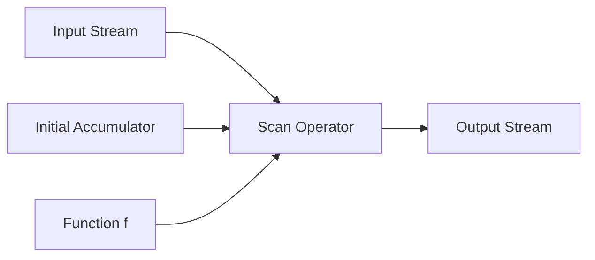
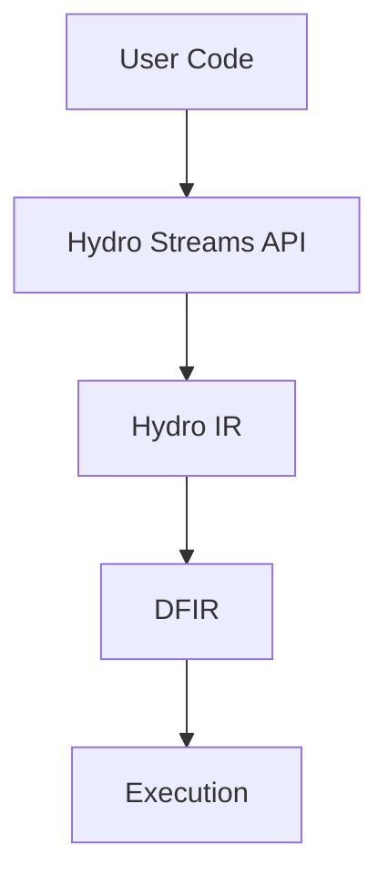
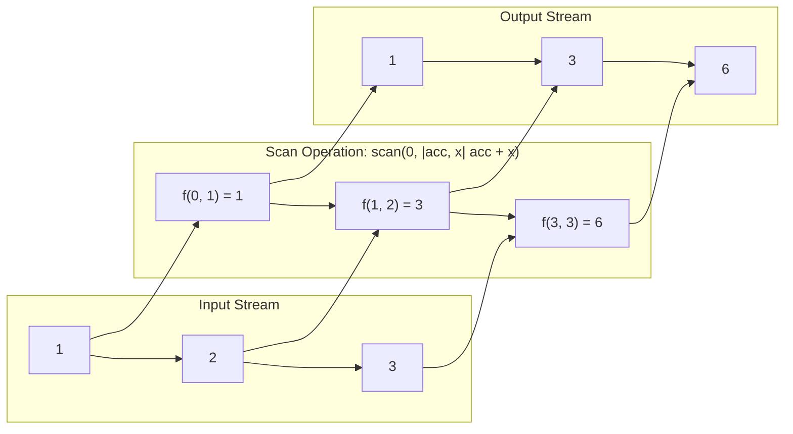

# Design Document: Scan Operator for Totally-Ordered Streams

## Overview

The `scan` operator is a higher-order function that applies a given function to each element of a stream, maintaining an internal state (accumulator) and emitting the intermediate results after processing each element. Unlike `fold` which only returns the final accumulated value, `scan` produces a new stream containing all intermediate accumulated values.

This design document outlines the implementation of the `scan` operator for totally-ordered streams in the Hydro framework, covering its implementation across the DFIR, Hydro IR, and Hydro streams API layers.

## Architecture

The implementation of the `scan` operator will span across three main layers of the Hydro framework:

1. **DFIR Layer**: The core implementation of the `scan` operator will be in the DFIR (Dataflow Intermediate Representation) layer, which provides the low-level dataflow operations.

2. **Hydro IR Layer**: The `scan` operator will be added to the Hydro IR, which serves as an intermediate representation between the high-level Hydro API and the low-level DFIR.

3. **Hydro Streams API Layer**: The `scan` operator will be exposed as a method on totally-ordered streams, providing a user-friendly interface for developers.

The flow of data and control will be:
- User code calls the `scan` method on a totally-ordered stream
- The Hydro Streams API translates this to a Hydro IR operation
- The Hydro IR compiles down to the DFIR operator
- The DFIR executes the actual scan operation

## Components and Interfaces

### 1. DFIR Scan Operator

The DFIR scan operator will be implemented as a new operator in the DFIR framework, following the pattern of the existing `fold` operator but with behavior matching Rust's standard library `scan` method:

```rust
/// > 1 input stream, 1 output stream
///
/// > Arguments: two arguments, both closures. The first closure is used to create the initial
/// > value for the accumulator, and the second is used to transform new items with the existing
/// > accumulator value. The second closure takes two arguments: an `&mut Accum` accumulated
/// > value, and an `Item`, and returns an `Option<Output>` that will be emitted to the output stream
/// > if it's `Some`, or terminate the stream if it's `None`.
///
/// Similar to Rust's standard library `scan` method. It applies a function to each element of the stream,
/// maintaining an internal state (accumulator) and emitting the values returned by the function.
/// The function can return `None` to terminate the stream early.
///
/// > Note: The closures have access to the [`context` object](surface_flows.mdx#the-context-object).
///
/// `scan` can also be provided with one generic lifetime persistence argument, either
/// `'tick` or `'static`, to specify how data persists. With `'tick`, the accumulator will only be maintained
/// within the same tick. With `'static`, the accumulated value will be remembered across ticks.
/// When not explicitly specified persistence defaults to `'tick`.
///
/// ```dfir
/// // Running sum example
/// source_iter([1, 2, 3, 4])
///     -> scan::<'tick>(|| 0, |acc: &mut i32, x: i32| {
///         *acc += x;
///         Some(*acc)
///     })
///     -> assert_eq([1, 3, 6, 10]);
///
/// // Early termination example
/// source_iter([1, 2, 3, 4])
///     -> scan::<'tick>(|| 1, |state: &mut i32, x: i32| {
///         *state = *state * x;
///         if *state > 6 {
///             None
///         } else {
///             Some(-*state)
///         }
///     })
///     -> assert_eq([-1, -2, -6]);
/// ```
pub const SCAN: OperatorConstraints = OperatorConstraints {
    name: "scan",
    categories: &[OperatorCategory::Fold],
    hard_range_inn: RANGE_1,
    soft_range_inn: RANGE_1,
    hard_range_out: RANGE_1,
    soft_range_out: RANGE_1,
    num_args: 2,
    persistence_args: &(0..=1),
    type_args: RANGE_0,
    is_external_input: false,
    has_singleton_output: false,
    // ... other fields similar to FOLD
    write_fn: |wc, diagnostics| {
        // Implementation will handle the Option return type and early termination
    },
};
```

The key differences from `fold` are:
1. `scan` emits each intermediate result to the output stream
2. `scan` has `has_singleton_output: false` since it produces a stream, not a singleton
3. The function returns `Option<Output>` to allow for early termination
4. The write function will emit each intermediate result after applying the function, and stop when None is returned

### 2. Hydro IR Integration

The scan operator will be added to the Hydro IR as a new node type in the `HydroNode` enum:

```rust
pub enum HydroNode {
    // Existing node types...
    Scan {
        init: DebugExpr,
        acc: DebugExpr,
        input: Box<HydroNode>,
        metadata: HydroIrMetadata,
    },
    // Other node types...
}
```

This follows the same pattern as the existing `Fold` node type. The `init` field contains the initial value expression, the `acc` field contains the accumulator function, and the `input` field contains the input stream node.

The IR will handle the translation of this node to the corresponding DFIR operator during compilation.

### 3. Hydro Streams API

The `scan` method will be added to the `Stream` trait, but with constraints that it can only be used with streams that have `TotalOrder` ordering and `ExactlyOnce` retries:

```rust
impl<'a, T, L, B> Stream<T, L, B, TotalOrder, ExactlyOnce>
where
    L: Location<'a>,
{
    /// Applies a function to each element of the stream, maintaining an internal state (accumulator)
    /// and emitting each intermediate result.
    ///
    /// Unlike `fold` which only returns the final accumulated value, `scan` produces a new stream
    /// containing all intermediate accumulated values.
    ///
    /// # Examples
    /// 
    /// Basic usage - running sum:
    /// ```rust
    /// # use hydro_lang::*;
    /// # use futures::StreamExt;
    /// # tokio_test::block_on(test_util::stream_transform_test(|process| {
    /// process
    ///     .source_iter(q!(vec![1, 2, 3, 4]))
    ///     .scan(q!(|| 0), q!(|acc, x| { 
    ///         *acc += x; 
    ///         Some(*acc)
    ///     }))
    /// # }, |mut stream| async move {
    /// // 1, 3, 6, 10
    /// # for w in vec![1, 3, 6, 10] {
    /// #     assert_eq!(stream.next().await.unwrap(), w);
    /// # }
    /// # }));
    /// ```
    /// 
    /// Early termination and different output type:
    /// ```rust
    /// # use hydro_lang::*;
    /// # use futures::StreamExt;
    /// # tokio_test::block_on(test_util::stream_transform_test(|process| {
    /// process
    ///     .source_iter(q!(vec![1, 2, 3, 4]))
    ///     .scan(q!(|| 1), q!(|state, x| {
    ///         // each iteration, multiply the state by the element
    ///         *state = *state * x;
    ///         
    ///         // terminate if the state exceeds 6
    ///         if *state > 6 {
    ///             None
    ///         } else {
    ///             // else yield the negation of the state
    ///             Some(-*state)
    ///         }
    ///     }))
    /// # }, |mut stream| async move {
    /// // -1, -2, -6
    /// # for w in vec![-1, -2, -6] {
    /// #     assert_eq!(stream.next().await.unwrap(), w);
    /// # }
    /// # }));
    /// ```
    pub fn scan<A, U, I, F>(
        self,
        init: impl IntoQuotedMut<'a, I, L>,
        f: impl IntoQuotedMut<'a, F, L>,
    ) -> Stream<U, L, B, TotalOrder, ExactlyOnce>
    where
        I: Fn() -> A + 'a,
        F: Fn(&mut A, T) -> Option<U> + 'a,
    {
        let init = init.splice_fn0_ctx(&self.location).into();
        let f = f.splice_fn2_borrow_mut_ctx(&self.location).into();

        Stream::new(
            self.location.clone(),
            HydroNode::Scan {
                init,
                acc: f,
                input: Box::new(self.ir_node.into_inner()),
                metadata: self.location.new_node_metadata::<U>(),
            },
        )
    }
}
```

This implementation follows the pattern of the existing `fold` method but returns a stream of intermediate results instead of a singleton with the final result.

## Data Models

### Scan Operation Data Flow

The scan operator processes data as follows:

1. Initialize the accumulator with the provided initial value.
2. For each element in the input stream:
   a. Apply the function to the current accumulator value and the element.
   b. Update the accumulator with the result.
   c. Emit the result to the output stream.

```
Input Stream: [x1, x2, x3, ...]
Initial Accumulator: acc0
Function: f(acc, x) -> result

Output Stream: [
    f(acc0, x1) -> result1,
    f(acc1, x2) -> result2,
    f(acc2, x3) -> result3,
    ...
]

Where acc1 = result1, acc2 = result2, etc.
```

### Type Constraints

The scan operator will have the following type constraints:

- The input stream must have `TotalOrder` ordering.
- The input stream must have `ExactlyOnce` retries to ensure deterministic accumulation.
- The accumulator type must be `Clone` to allow for state management.
- The function must have the signature `FnMut(&mut Acc, T) -> Option<U>`, where:
  - `Acc` is the accumulator type
  - `T` is the input element type
  - `U` is the output element type
  - Returning `None` terminates the stream

## Error Handling

The scan operator will handle errors in the following ways:

1. **Compile-time Errors**:
   - If the scan operator is applied to a stream without `TotalOrder` ordering, a compile-time error will be generated.
   - If the scan operator is applied to a stream without `ExactlyOnce` retries, a compile-time error will be generated.
   - If the provided function doesn't match the expected signature, a compile-time error will be generated.

2. **Runtime Errors**:
   - If the function panics during execution, the panic will propagate according to the standard Rust panic handling mechanisms.
   - The scan operator itself will not introduce additional runtime error handling beyond what's provided by the underlying DFIR framework.

## Testing Strategy

The testing strategy for the scan operator will include:

1. **Unit Tests**:
   - Test the DFIR scan operator with various input types and functions.
   - Test edge cases such as empty streams and identity functions.
   - Test with different accumulator types and functions.

2. **Integration Tests**:
   - Test the scan operator in combination with other stream operators.
   - Test the scan operator in the context of larger dataflow graphs.

3. **Type System Tests**:
   - Test that the scan operator can only be used with streams that have `TotalOrder` ordering.
   - Test that compile-time errors are generated for incorrect usage.

## Implementation Plan

The implementation will proceed in the following order:

1. Implement the DFIR scan operator in `dfir_rs`.
2. Add tests for the DFIR scan operator.
3. Add the scan node type to Hydro IR in `hydro_lang`.
4. Implement the translation from Hydro IR to DFIR for the scan operator.
5. Add the `scan` method to the `Stream` trait for streams with `TotalOrder` ordering.
6. Add documentation and examples for the scan operator.
7. Add integration tests that verify the end-to-end functionality.

## Diagrams

### Scan Operator Data Flow



### Architecture Layers



### Scan Operation Example

