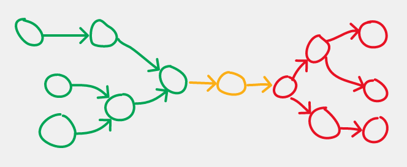

# Subgraph In-Out Trees

Formally, we define an in-out-tree is the union of an
_in-tree_ ([_anti-arborescence_](https://en.wikipedia.org/wiki/Arborescence_%28graph_theory%29#cite_ref-KorteVygen2012b_17-0))
with an _out-tree_ ([_arborescence_](https://en.wikipedia.org/wiki/Arborescence_%28graph_theory%29))
where both trees share the same _root_ node.

||
| :---: |
|  |
| An _in-out tree_ graph. Data flows from the green _pull_ operators on the left, through the yellow pivot, and to the red _push_ operators on the right. |

In this graph representation, each node corresponds to an operator, and the
edges direct the flow of data between operators.

## Converting Graph

Any graph can be partitioned into in-out trees. Any non-trivial graph will have many possible
partitionings to choose from; a useful heuristic is to partition the graph
into as few subgraphs as possible, in order to minimize scheduling overheads.

Most graphs are pretty simple and can be partitioned with a bit of eye-balling.
To do this systematically, we can use a simple
coloring algorithm.

||
| :---: |
|  |
| An example directed graph. |

To identify the in-out trees in an arbitrary directed graph, first identify any
nodes which have multiple inputs and outputs and mark these as pull-to-push
_pivots_ (yellow in the example). Mark any nodes with multiple inputs (and a
single output) as _pull_ (green) and any nodes with multiple outputs as _push_
(red).

In the example:

| Pivots (yellow) | Pulls (green) | Pushes (red) |
| --------------- | ------------- | ------------ |
| 1, 4            | 2             | 3, 7         |

Finally any one-in-one-out nodes should be marked the same as their neighbors
(either green pull or red push). If we have green pull -> red push that becomes
a yellow pivot. And if red push -> green pull that becomes a blue handoff node,
and this is a division between subgraphs. Note that a subgraph can have a
handoff with itself; this forms a loop.

||
| :---: |
|  |
| The graph above converted and partitioned into two in-out trees. One is outlined in yellow and the other in red. For the corresponding Hydroflow graph, green nodes are _pull_, red nodes are _push_, yellow are _pivots_, and blue are _handoffs_. |

In the example partitioning above, some nodes have been split into multiple and
labelled with suffixes to make the pivots and handoffs more explicit.
