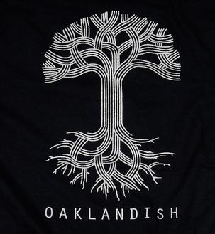

# Architecture

Hydroflow graphs are divided into two layers: the outer _scheduled layer_ and
inner _compiled layer_.

In the mermaid diagrams generated for Hydroflow, the scheduler is responsible for the outermost gray boxes 
(the *subgraphs*)
and handoffs, while the insides of the gray boxes are compiled via the compiled layer. As a reminder,
here is the graph from the
[reachability](../quickstart/example_5_reachability.md) chapter, which we will use a running example:

```mermaid
%%{init: {'theme': 'base', 'themeVariables': {'clusterBkg':'#ddd'}}}%%
flowchart TD
classDef pullClass fill:#02f,color:#fff,stroke:#000
classDef pushClass fill:#ff0,stroke:#000
linkStyle default stroke:#aaa,stroke-width:4px,color:red,font-size:1.5em;
subgraph "sg_1v1 stratum 0"
    1v1[\"(1v1) <tt>source_iter(vec! [0])</tt>"/]:::pullClass
    2v1[\"(2v1) <tt>source_stream(edges_recv)</tt>"/]:::pullClass
    3v1[\"(3v1) <tt>union()</tt>"/]:::pullClass
    7v1[\"(7v1) <tt>map(| v | (v, ()))</tt>"/]:::pullClass
    4v1[\"(4v1) <tt>join()</tt>"/]:::pullClass
    5v1[/"(5v1) <tt>flat_map(| (src, ((), dst)) | [src, dst])</tt>"\]:::pushClass
    6v1[/"(6v1) <tt>tee()</tt>"\]:::pushClass
    10v1["(10v1) <tt>handoff</tt>"]:::otherClass
    10v1--1--->3v1
    1v1--0--->3v1
    2v1--1--->4v1
    3v1--->7v1
    7v1--0--->4v1
    4v1--->5v1
    5v1--->6v1
    6v1--0--->10v1
end
subgraph "sg_2v1 stratum 1"
    8v1[/"(8v1) <tt>unique()</tt>"\]:::pushClass
    9v1[/"(9v1) <tt>for_each(| x | println! (&quot;Reached: {}&quot;, x))</tt>"\]:::pushClass
    8v1--->9v1
end
6v1--1--->11v1
11v1["(11v1) <tt>handoff</tt>"]:::otherClass
11v1===o8v1
```

The [Hydroflow Architecture Design Doc](https://hydro-project.github.io/hydroflow/design_docs/2021-10_architecture_design_doc.html)
contains a more detailed explanation of this section. Note that some aspects of
the design doc are not implemented (e.g. early yielding) or may become out of
date as time passes.

## Scheduled Layer

The scheduled layer is dynamic: it stores a list of operators (or "subgraphs")
as well as buffers ("handoffs") between them. The scheduled layer chooses how
to schedule the operators (naturally), and when each operator runs it pulls
from its input handoffs and pushes to its output handoffs. This setup is
extremely flexible: operators can have any number of input or output handoffs
so we can easily represent any graph topology. However this flexibility comes
at a performance cost due to the overhead of scheduling, buffering, and lack
of inter-operator compiler optimization.

The _compiled layer_ helps avoids the costs of the scheduled layer. We can
combine several operators into a _subgraph_ which are compiled and optimized as
a single scheduled subgraph. The scheduled layer then runs the entire subgraph
as if it was one operator with many inputs and outputs. Note the layering here:
the compiled layer does not replace the scheduled layer but instead exists
within it.

## Compiled Layer

Rust already has a built-in API similar to dataflow: [`Iterator`s](https://doc.rust-lang.org/std/iter/trait.Iterator.html).
When they work well, they work really well and tend to be as fast as for loops.
However, they are limited in the flow graphs they can represent. Each operator
in a `Iterator` takes ownership of, and _pulls_ from, the previous operator.
Taking two iterators as _inputs_ and merging them together (e.g. with
[`.chain(...)`](https://doc.rust-lang.org/std/iter/trait.Iterator.html#method.chain)
or [`.zip(...)`](https://doc.rust-lang.org/std/iter/trait.Iterator.html#method.zip))
is natural and performant as we can _pull_ from both. However if we want an
iterator to split into multiple _outputs_ then things become tricky. [`Itertools::tee()`](https://docs.rs/itertools/latest/itertools/trait.Itertools.html#method.tee)
does just this by cloning each incoming item into two output buffers, but this
requires allocation and could cause unbounded buffer growth if the outputs are
not read from at relatively even rates.

However, if instead iterators were _push_-based, where each operator owns one
or more _output_ operators, then teeing is very easy, just clone each element
and push to (i.e. run) both outputs. So that's what we did, created push-based
iterators to allow fast teeing or splitting in the compiled layer.

Pull-based iterators can be connected to push-based iterators at a single "pivot"
point. Together, this pull-to-push setup dictates the shape compiled subgraphs
can take. Informally, this is like the roots and leaves of a tree. Water flows
from the roots (the pull inputs), eventually all join together in the trunk
(the pull-to-push pivot), the split up into multiple outputs in the leaves.
We refer to this structure as an _in-out tree_.

||
| :---: |
|  |
| The Oaklandish Logo. |

In the reachability example above, the pivot is the `flat_map()` operator: it pulls from the join that feeds it, and pushes to the tee that follows it. In essence that `flat_map()` serves as the main thread of the compiled component.

See [Subgraph In-Out Trees](./in-out_trees.md) for more, including how to
convert a graph into in-out trees.

## Surface Syntax and APIs

Hydroflow's _Surface Syntax_ hides
the distinction between these two layers. It offers a natural `Iterator`-like chaining syntax for building 
graphs that get parsed and compiled into a scheduled graph of one or more compiled subgraphs. Please see the [Surface Syntax](../syntax/index.md) docs for more information.

Alternatively, the _Core API_ allows you to interact with handoffs directly at a low
level. It doesn't provide any notion of chainable operators. You can use Rust `Iterator`s
or any other arbitrary Rust code to implement the operators.

The Core API lives in [`hydroflow::scheduled`](https://hydro-project.github.io/hydroflow/doc/hydroflow/scheduled/index.html),
mainly in methods on the [`Hydroflow` struct](https://hydro-project.github.io/hydroflow/doc/hydroflow/scheduled/graph/struct.Hydroflow.html).  Compiled push-based iterators live in [`hydroflow::compiled`](https://hydro-project.github.io/hydroflow/doc/hydroflow/compiled/index.html). We intend users to use the Surface Syntax as it is much more friendly, but as
Hydroflow is in active development some operators might not be available in
the Surface Syntax, in which case the Core API can be used instead. If you find
yourself in this sitation be sure to [submit an issue](https://github.com/hydro-project/hydroflow/issues/new)!

